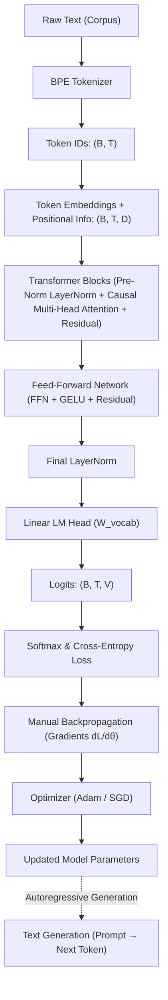

# GPT FROM SCRATCH — PROJECT EXPLANATION

A concise conceptual guide to **NumPyGPT**: built entirely from scratch using pure Python and NumPy without PyTorch, TensorFlow, Hugging Face, or automatic differentiation frameworks.

---

## 1. Overall Goal

Build a small decoder-only GPT language model where every mathematical step—from tokenization to attention, loss calculation, backpropagation, and optimization—is implemented directly in pure Python and NumPy.

### Complete System Pipeline



---

## 2. Project Files (Current Stage: Phase 1)

```text
numpy_gpt/
├── data/
│   └── input.txt          # Tiny Shakespeare corpus (1.11M characters)
├── tokenizer.py           # Subword Byte Pair Encoding (BPE) tokenizer
├── tests/
│   └── test_components.py # Verification tests for dataset and tokenizer
└── explanation.md         # This conceptual reference document
```

*(Future files: `embeddings.py`, `attention.py`, `transformer.py`, `loss.py`, `optimizer.py`, `model.py`, `train.py`, `generate.py` will be added to this document as each phase is completed.)*

---

## 3. Byte Pair Encoding (BPE) Concept

### What is BPE?
**BPE (Byte Pair Encoding)** is an unsupervised subword tokenization algorithm. It begins with individual characters as base tokens and repeatedly merges the most frequently occurring adjacent pair into a new combined subword token.

### Merge Example
```text
Initial characters:   a  b  a  b  a  b  a  b
Merge ('a', 'b'):    ab    ab    ab    ab
Merge ('ab', 'ab'):  abab        abab
Merge ('abab', 'abab'): abababab
```

### Why BPE is Needed
1. **Compact Sequences**: Common words (`"the"`, `"you"`) become single tokens, cutting sequence length in half and reducing Transformer attention compute.
2. **Manageable Vocabulary**: Allows a controlled vocabulary size ($300\text{--}1000$ tokens) that fits comfortably in memory.
3. **Zero Out-of-Vocabulary Dead Ends**: Unseen or rare words are decomposed into known character and subword pieces.

### Tokenizer Pipeline
```text
Raw Text: "hello world"
   ↓
Regex Chunks: ["hello", " ", "world"]
   ↓
BPE Subword Tokens: ["he", "llo", " ", "world"]
   ↓
Integer Token IDs: [42, 87, 5, 103]
```

---

## 4. Three Distinct Concepts

It is crucial not to confuse these three representations:

| Concept | Example | What It Is | Role in GPT |
| :--- | :--- | :--- | :--- |
| **BPE Subword Token** | `"he"` | String text chunk | Decided by BPE merge frequency on text. |
| **Token ID** | `42` | Discrete integer index | Discrete index mapped by vocabulary tables. |
| **Embedding Vector** | `[0.12, -0.31, 0.87, ...]` | Continuous float vector | Learned continuous feature representation used by the Transformer. |

- **BPE** determines **WHAT** the token string is.
- **Vocabulary** assigns that token an **INTEGER ID**.
- **Embedding Matrix** turns that integer ID into a **DENSE VECTOR**.

---

## 5. `tokenizer.py` Functions

### `__init__(vocab_size=500, special_tokens=None)`
- **WHAT**: Initializes vocabulary mappings (`token_to_id`, `id_to_token`), merge tables (`merges`, `merge_ranks`), and target vocabulary size.
- **WHY**: Sets up empty state tables before training or loading a tokenizer.
- **OUTPUT**: Returns `None`. Creates an initialized `BPETokenizer` object with empty lookup tables and defined configuration.

### `_init_base_vocab(text)`
- **WHAT**: Extracts all unique characters from `text`, registers special tokens (`<|unk|>`, `<|endoftext|>`), and assigns initial integer IDs.
- **WHY**: BPE requires a base single-character alphabet before it can discover multi-character pairs.
- **OUTPUT**: Returns `None`. Populates `token_to_id` and `id_to_token` with base characters and special tokens.

### `train(text, verbose=False)`
- **WHAT**: Pre-tokenizes text into chunks, counts adjacent symbol pairs, iteratively finds the most frequent pair, and merges it into a new subword token.
- **WHY**: Automatically learns the subword vocabulary and merge rules from the raw dataset without human supervision.
- **OUTPUT**: Returns `None`. Fills `merges`, `merge_ranks`, and vocabulary tables up to `vocab_size`.

### `_encode_chunk(chunk)`
- **WHAT**: Decomposes a single word or punctuation chunk into characters and applies learned merges in order of priority rank.
- **WHY**: Ensures test-time words are merged using the exact chronological order of rules learned during training.
- **OUTPUT**: Returns `List[str]` containing subword string tokens (e.g. `["B", "e", "fore"]`), NOT integer IDs.

### `encode(text)`
- **WHAT**: Splits raw text while protecting special tokens, calls `_encode_chunk` on each chunk, and maps all tokens to integer IDs.
- **WHY**: Neural networks cannot take text strings directly; they require integer indices to select rows from embedding matrices.
- **OUTPUT**: Returns `List[int]` representing the sequence of integer token IDs.

### `decode(ids)`
- **WHAT**: Looks up each integer ID in `id_to_token` and concatenates the resulting token strings back into a single string.
- **WHY**: Converts model-generated integer token IDs back into human-readable text.
- **OUTPUT**: Returns `str`: the reconstructed text string matching original punctuation, spaces, and newlines.

### `save(filepath)`
- **WHAT**: Writes `vocab_size`, `special_tokens`, `token_to_id`, and `merges` to a JSON file on disk.
- **WHY**: Allows a trained tokenizer to be saved once and reloaded without having to retrain on the corpus.
- **OUTPUT**: Returns `None`. Creates a JSON file on disk.

### `load(filepath)`
- **WHAT**: Reads a JSON file from disk and reconstructs a fully functional `BPETokenizer` instance.
- **WHY**: Restores a previously trained tokenizer for inference or continued training.
- **OUTPUT**: Returns `BPETokenizer`: an instantiated tokenizer ready for immediate encoding and decoding.

---

## 6. `tests/test_components.py` (Phase 1 Tests)

### `test_dataset_exists_and_valid()`
- **WHAT**: Checks that `data/input.txt` exists, is non-empty ($>1\text{M}$ characters), and contains authentic Shakespeare dialogue.
- **WHY**: Verifies that the training corpus is present before downstream operations rely on it.
- **OUTPUT**: Returns `None`. Asserts file existence, character count, and content validity.

### `test_bpe_training_and_vocab_growth()`
- **WHAT**: Trains BPE on a text snippet with target `vocab_size=60` and checks vocabulary length.
- **WHY**: Confirms that iterative pair merging grows vocabulary from base characters to the requested size.
- **OUTPUT**: Returns `None`. Asserts `len(token_to_id) == target_vocab`.

### `test_bpe_roundtrip_lossless()`
- **WHAT**: Encodes Shakespeare dialogue and verifies that `decode(encode(text)) == text`.
- **WHY**: Proves that tokenization and detokenization do not alter, drop, or corrupt text.
- **OUTPUT**: Returns `None`. Asserts exact string equality between input and output.

### `test_bpe_edge_cases()`
- **WHAT**: Tests boundary cases: empty string `""`, single character `"H"`, repeated characters `"aaaaa"`, and whitespace/newlines.
- **WHY**: Guarantees the tokenizer does not crash or loop infinitely on edge inputs.
- **OUTPUT**: Returns `None`. Asserts correct handling across all edge inputs.

### `test_bpe_special_tokens()`
- **WHAT**: Encodes text containing `<|endoftext|>` and verifies it remains a single discrete token ID.
- **WHY**: Special control tokens must never be broken down into individual characters.
- **OUTPUT**: Returns `None`. Asserts `<|endoftext|>` is encoded and decoded as an atomic unit.

### `test_bpe_unknown_character()`
- **WHAT**: Encodes text with unseen characters (e.g. an emoji) and verifies mapping to `<|unk|>`.
- **WHY**: Ensures tokenizer handles unseen out-of-corpus characters gracefully without crashing.
- **OUTPUT**: Returns `None`. Asserts that `<|unk|>` ID is assigned to unknown symbols.

### `test_bpe_save_and_load()`
- **WHAT**: Serializes a tokenizer to JSON, reloads it, and verifies identical encoding outputs.
- **WHY**: Confirms that saving and loading preserves the exact merge table and token mappings.
- **OUTPUT**: Returns `None`. Asserts loaded tokenizer matches original outputs.

### `test_bpe_compression_efficiency()`
- **WHAT**: Measures sequence length reduction: $\text{characters} / \text{tokens}$.
- **WHY**: Proves that BPE is meaningfully compressing text (compression ratio $>1.3\times$), saving Transformer attention compute.
- **OUTPUT**: Returns `None`. Asserts that token count is significantly lower than character count.
